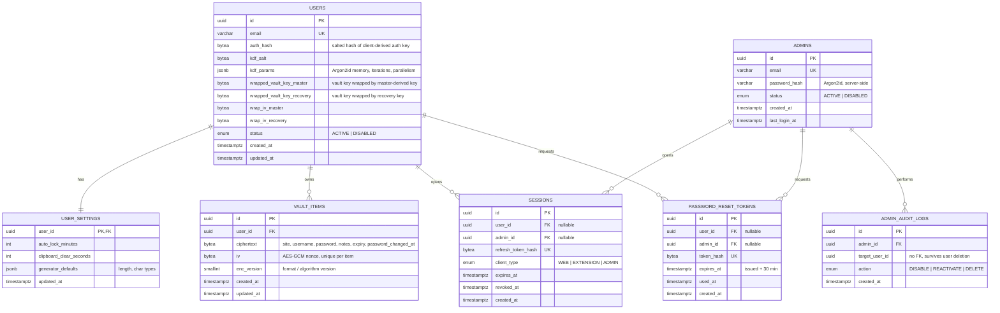

# Padlock: Database Design & ERD

PostgreSQL + Prisma. Zero-knowledge: the server stores only ciphertext and wrapped keys (NFR-SEC-5, 7, 8, 9).

## 1. ERD



## 2. Table overview

| Table | Purpose | SRS trace |
|---|---|---|
| `users` | Account, auth hash, KDF params, both wrapped vault keys | FR-1, FR-11, NFR-SEC-2/7/9 |
| `user_settings` | Auto-lock, clipboard clear timer, generator defaults | FR-7, FR-4.4 |
| `vault_items` | One encrypted blob per credential | FR-2, FR-3, FR-5, FR-6, FR-8, NFR-SEC-8 |
| `admins` | Separate identity store for administrators | FR-12, NFR-SEC-4/5 |
| `sessions` | Hashed refresh tokens (JWT + HTTP-only cookie) | Sec. 6.2 auth |
| `password_reset_tokens` | Single-use, 30-min reset links for users and admins | FR-1.4, FR-12.3, NFR-SEC-10 |
| `admin_audit_logs` | Record of disable / reactivate / delete (optional, recommended) | FR-13 |

## 3. Property dictionary

### 3.1 `users`

| Property | Type | Explanation |
|---|---|---|
| `id` | uuid PK | Unique account ID. A random UUID avoids guessable sequential IDs. |
| `email` | varchar, UNIQUE | Login identifier and target for reset emails (FR-11.1). Store lowercase. |
| `auth_hash` | bytea | Salted server-side hash of the *authentication key* the client derives from the master password. The server verifies login with it and never sees the master password (NFR-SEC-2). |
| `kdf_salt` | bytea | Random salt for Argon2id on the client. Not secret; sent to the client at login so it can re-derive keys. |
| `kdf_params` | jsonb | Argon2id memory, iterations and parallelism used for this user. Lets you raise the cost later without breaking old accounts. |
| `wrapped_vault_key_master` | bytea | The random vault key encrypted (wrapped) with the key derived from the master password. Unlocks the vault on login. |
| `wrapped_vault_key_recovery` | bytea | The same vault key wrapped with the recovery key (NFR-SEC-9). Used when the master password is forgotten (FR-1.5). Replaced after each reset (FR-1.6). |
| `wrap_iv_master` | bytea | AES-GCM nonce used when wrapping with the master-derived key. Needed to unwrap. |
| `wrap_iv_recovery` | bytea | AES-GCM nonce used when wrapping with the recovery key. |
| `status` | enum | `ACTIVE` or `DISABLED`. Admins toggle it (FR-13.2). Login is rejected when disabled. |
| `created_at` | timestamptz | Sign-up time. |
| `updated_at` | timestamptz | Last change to the row, e.g. master password change. |

### 3.2 `user_settings`

| Property | Type | Explanation |
|---|---|---|
| `user_id` | uuid PK, FK | Both primary and foreign key to `users`, which makes the relation 1:1. Deleted with the user. |
| `auto_lock_minutes` | int | Inactivity time before the web app or extension locks (FR-7.1). |
| `clipboard_clear_seconds` | int | Delay before a copied password is wiped from the clipboard (FR-7.3). |
| `generator_defaults` | jsonb | Preferred password length and character types (FR-4.4). |
| `updated_at` | timestamptz | Last settings change. |

### 3.3 `vault_items`

| Property | Type | Explanation |
|---|---|---|
| `id` | uuid PK | Credential ID. |
| `user_id` | uuid FK | Owner. ON DELETE CASCADE, so deleting a user removes their items. |
| `ciphertext` | bytea | The whole credential, AES-256-GCM encrypted on the client: site, URL, username, password, notes, expiry and password-changed date. The server can't read any of it. |
| `iv` | bytea | AES-GCM nonce (12 bytes). Must be new on every write, never reused under the same key. |
| `enc_version` | smallint | Format and algorithm version of the blob. Allows future crypto upgrades. |
| `created_at` | timestamptz | When the row was first stored. |
| `updated_at` | timestamptz | Last modification. Used for sync and ordering. |

### 3.4 `admins`

| Property | Type | Explanation |
|---|---|---|
| `id` | uuid PK | Admin ID. |
| `email` | varchar, UNIQUE | Admin login and reset-email address (FR-12.3). |
| `password_hash` | varchar | Argon2id hash of the admin password. Admins have no vault, so this is an ordinary server-side hash. |
| `status` | enum | `ACTIVE` or `DISABLED`, so an admin can be revoked without deleting audit history. |
| `created_at` | timestamptz | When the admin was created. |
| `last_login_at` | timestamptz | Last successful login, for monitoring. |

### 3.5 `sessions`

| Property | Type | Explanation |
|---|---|---|
| `id` | uuid PK | Session ID. |
| `user_id` | uuid FK, nullable | Set when the session belongs to an end user. |
| `admin_id` | uuid FK, nullable | Set when it belongs to an admin. Exactly one of the two is non-null (CHECK). |
| `refresh_token_hash` | bytea, UNIQUE | Hash of the refresh token in the HTTP-only cookie. Only the hash is stored, so a DB leak can't be replayed. |
| `client_type` | enum | `WEB`, `EXTENSION` or `ADMIN`. Lets users see and revoke sessions per client. |
| `expires_at` | timestamptz | When the refresh token stops being valid. |
| `revoked_at` | timestamptz | Set on logout, reset or disable. NULL means still active. |
| `created_at` | timestamptz | Session start. |

### 3.6 `password_reset_tokens`

| Property | Type | Explanation |
|---|---|---|
| `id` | uuid PK | Token record ID. |
| `user_id` | uuid FK, nullable | Set for end-user resets (FR-1.4). |
| `admin_id` | uuid FK, nullable | Set for admin resets (FR-12.3). Exactly one is non-null. |
| `token_hash` | bytea, UNIQUE | Hash of the random token in the emailed link. The raw token exists only in the email. |
| `expires_at` | timestamptz | Issue time plus 30 minutes (NFR-SEC-10). |
| `used_at` | timestamptz | Set when the link is used, which makes it single-use. Valid only if NULL and `expires_at` is in the future. |
| `created_at` | timestamptz | Issue time. |

### 3.7 `admin_audit_logs`

| Property | Type | Explanation |
|---|---|---|
| `id` | uuid PK | Log entry ID. |
| `admin_id` | uuid FK | Admin who performed the action. |
| `target_user_id` | uuid, no FK | Affected user. No FK so the record remains after the user is deleted (FR-13.3). |
| `action` | enum | `DISABLE`, `REACTIVATE` or `DELETE` (FR-13.2, 13.3). |
| `created_at` | timestamptz | When the action happened. |

## 4. Key constraints

| Table | Constraint |
|---|---|
| `users` | `email` UNIQUE, NOT NULL, stored lowercase |
| `vault_items` | FK `user_id` ON DELETE CASCADE; INDEX `(user_id, updated_at)` for sync |
| `user_settings` | PK = FK `user_id` (1:1), ON DELETE CASCADE |
| `sessions`, `password_reset_tokens` | CHECK exactly one of `user_id` / `admin_id` is non-null; ON DELETE CASCADE |
| `password_reset_tokens` | Valid only if `used_at IS NULL AND expires_at > now()` |
| `admin_audit_logs` | `target_user_id` has no FK so the log outlives FR-13.3 deletion |

## 5. What lives inside `vault_items.ciphertext`

The server never sees these fields (client-side JSON, then AES-256-GCM):

```json
{
  "site": "...", "url": "...", "username": "...", "password": "...",
  "notes": "...", "expires_at": "...", "password_changed_at": "...",
  "created_at": "..."
}
```

Security score, reuse detection, age, expiry reminders and search are all computed on the client after decrypt (FR-5, FR-6, FR-8, design decision 4).

## 6. Flow to table mapping

| Flow | DB effect |
|---|---|
| Sign up (FR-1.1/1.3) | Client derives keys, generates vault key + recovery key; server inserts `users` row (auth hash, salt, both wrapped keys) and default `user_settings` |
| Login (FR-1.2) | Verify `auth_hash`, check `status = ACTIVE`, insert `sessions` |
| Change master password (FR-11.2) | Re-wrap vault key: update `wrapped_vault_key_master`, `auth_hash`, `kdf_salt`; `vault_items` untouched |
| Forgot password, with recovery key (FR-1.4 to 1.6) | Insert reset token, email link, mark `used_at`; client unwraps with recovery key, then updates master wrap + issues new `wrapped_vault_key_recovery` |
| Reset without recovery key (FR-1.7) | Delete user's `vault_items`, replace the keys, revoke `sessions` |
| Add / edit / delete credential (FR-2) | INSERT / UPDATE / DELETE on `vault_items` |
| Admin disable / reactivate / delete (FR-13) | Update `users.status` or delete the row (cascade), then insert `admin_audit_logs` |

## 7. Design notes

1. **Separate `admins` table** instead of a role column on `users`: admin endpoints can never join to `vault_items` and admin accounts have no vault keys (NFR-SEC-5).
2. **Store token hashes only** (refresh and reset tokens), so a DB leak cannot be replayed.
3. **Reset requests must not leak registration** (NFR-SEC-11): the API returns the same response whether or not the email exists.
4. **Fresh IV per write**: generate a new 12-byte nonce on every item update; never reuse one under the same vault key.
5. **`enc_version`** allows future algorithm or KDF upgrades without a full re-encrypt.
6. **Cleanup job:** periodically delete expired/used `password_reset_tokens` and expired `sessions`.
7. **Two nullable FKs** in `sessions` and `password_reset_tokens` (with a CHECK) serve both users and admins. For stricter integrity, split each into user and admin versions.
8. **Audit log privacy:** storing the target's email in `admin_audit_logs` would help after deletion but is a privacy trade-off, so it is omitted.
9. **Not needed in the DB:** reuse alerts, scores and reminders (client-side), so no plaintext-derived columns exist.
