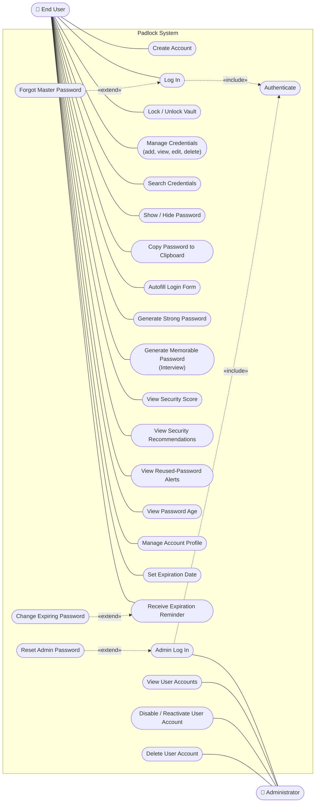
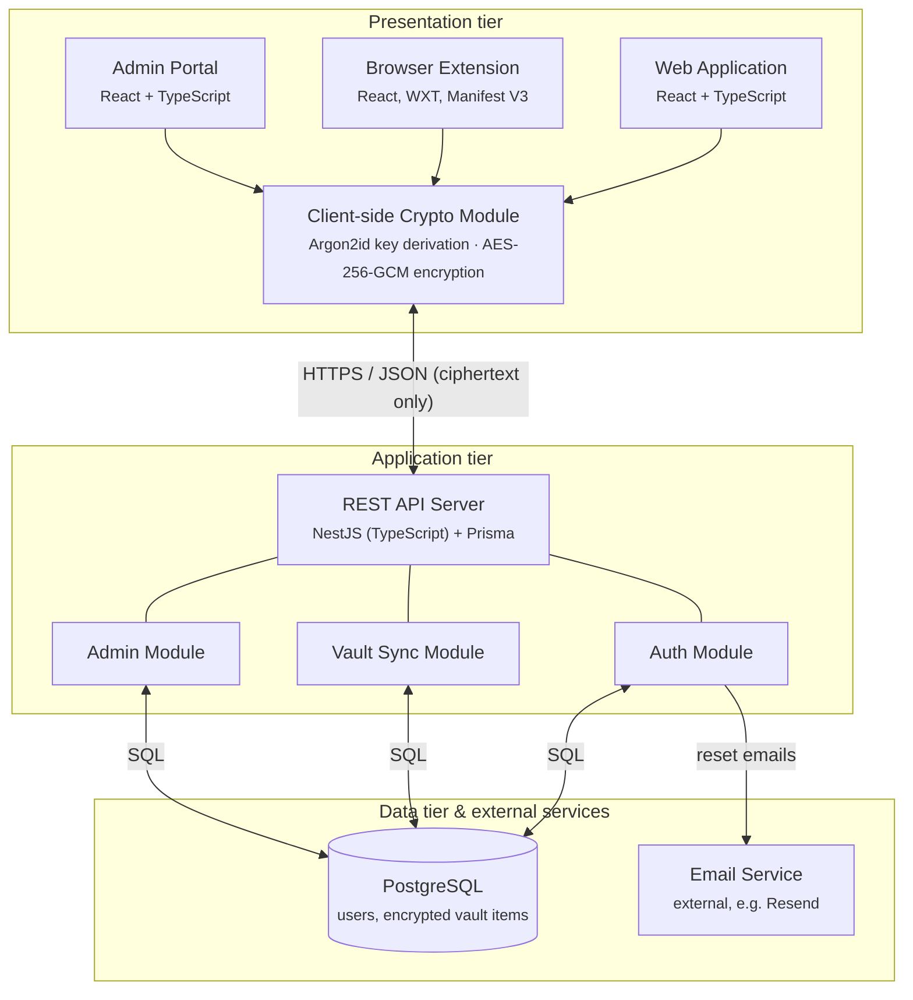

# Padlock — A Secure Password Manager

## Software Requirements Specification
*Use Case Model, Requirements & System Architecture*

| | |
|---|---|
| **University** | Georgia State University, Department of Computer Science |
| **Course** | CSC 6350 – Software Engineering |
| **Team** | GradStack |
| **Instructor** | Dr. David James |
| **Term** | Fall 2026 |
| **Version** | 1.0 |
| **Date** | September 24, 2026 |

---

## Revision History

| Date | Version | Description | Author |
|---|---|---|---|
| 09/24/2026 | 1.0 | Initial SRS: use case model, functional and non-functional requirements, proposed architecture | GradStack |

## Team Members

| Name | Role / Responsibility | Contact |
|---|---|---|
| Truong Le | Team point of contact / Developer | sle22@student.gsu.edu |
| Mehran Fekri | Member / Developer | mfekri1@student.gsu.edu |
| Jannati Chowdhury | Member / Developer | jchowdhury4@student.gsu.edu |
| Daniel Onyia | Member / Developer | donyia1@student.gsu.edu |

---

## Table of Contents

1. [Introduction](#1-introduction)
   - 1.1 [Purpose](#11-purpose)
   - 1.2 [Scope](#12-scope)
   - 1.3 [Definitions, Acronyms, and Abbreviations](#13-definitions-acronyms-and-abbreviations)
   - 1.4 [References](#14-references)
   - 1.5 [Overview](#15-overview)
2. [Overall Description](#2-overall-description)
   - 2.1 [Product Perspective](#21-product-perspective)
   - 2.2 [User Classes and Characteristics](#22-user-classes-and-characteristics)
   - 2.3 [Assumptions and Dependencies](#23-assumptions-and-dependencies)
3. [Use Case Model](#3-use-case-model)
   - 3.1 [End User Use Cases](#31-end-user-use-cases)
   - 3.2 [Administrator Use Cases](#32-administrator-use-cases)
4. [Functional Requirements](#4-functional-requirements)
   - 4.1 [End User Requirements](#41-end-user-requirements)
   - 4.2 [Administrator Requirements](#42-administrator-requirements)
5. [Non-Functional Requirements](#5-non-functional-requirements)
6. [System Architecture](#6-system-architecture)
   - 6.1 [Architectural Style](#61-architectural-style)
   - 6.2 [Technology Stack](#62-technology-stack)
   - 6.3 [Key Design Decisions](#63-key-design-decisions)
7. [Supporting Information](#7-supporting-information)

---

## 1. Introduction

### 1.1 Purpose

This Software Requirements Specification (SRS) describes the Padlock password manager. It identifies the system's user roles and their use cases, lists the functional and non-functional requirements, and proposes the technical architecture (front end, back end and database) that will satisfy those requirements. The document is intended for the development team, the course instructor, and any reviewer evaluating the design.

### 1.2 Scope

Padlock is a web-based password manager with a companion browser extension. It lets users store account credentials in an encrypted vault, autofill login forms, generate strong and memorable passwords, and monitor the health of their passwords (age, reuse, expiration and strength). An administrative interface allows authorized administrators to manage user accounts without ever being able to read users' stored passwords.

### 1.3 Definitions, Acronyms, and Abbreviations

| Term | Definition |
|---|---|
| Vault | The encrypted store holding a user's saved credentials. |
| Master Password | The single password a user memorizes to unlock their vault. It is never stored or transmitted in plain text. |
| Credential | A saved record containing a site/app, username, password, optional notes and an optional expiration date. |
| Autofill | Automatic insertion of saved credentials into a login or web form. |
| Vault Key | A random key that encrypts the vault. It is itself encrypted (wrapped) by keys derived from the master password and from the recovery key. |
| Recovery Key | A random, high-entropy key generated on the client at sign-up and shown to the user once. It can unwrap the vault key if the master password is forgotten. |
| Zero-knowledge | A design in which the server stores only encrypted data and cannot decrypt it. |
| AES-GCM | Advanced Encryption Standard in Galois/Counter Mode (authenticated encryption). |
| KDF | Key Derivation Function (e.g., Argon2id) that turns the master password into an encryption key. |
| API / REST | Application Programming Interface / Representational State Transfer. |
| TLS | Transport Layer Security, the protocol behind HTTPS. |
| SRS | Software Requirements Specification. |
| UC / FR / NFR | Use Case / Functional Requirement / Non-Functional Requirement. |

### 1.4 References

- E-Store Project, *Software Requirements Specification*, Version 4.0 (course example).
- Jelvix, "Software Requirements Specification (SRS): How to Write It," <https://jelvix.com/blog/software-requirements-specification>.

### 1.5 Overview

Section 2 gives an overall description of the product and its user roles. Section 3 presents the use case diagram and the use cases for each role. Section 4 lists the functional requirements and Section 5 the non-functional requirements. Section 6 describes the proposed architecture and technology stack, and Section 7 lists supporting information.

---

## 2. Overall Description

### 2.1 Product Perspective

People reuse weak passwords because strong, unique passwords are hard to remember. Padlock removes that burden: the user remembers one master password, and the system stores, generates and autofills everything else. Unlike a basic vault, Padlock also coaches users toward better password hygiene through security scores, reuse alerts, password-age tracking, expiration reminders, and an interview-style generator that produces secure passwords that are easier to remember.

### 2.2 User Classes and Characteristics

| Role | Description |
|---|---|
| End User | Any individual who stores and retrieves credentials through the web application or browser extension. Assumed to have basic computer and web-browsing skills only. |
| Administrator | A staff member who manages user accounts (view, disable, reactivate, delete) through a restricted administrative interface. Has no access to vault contents. |

### 2.3 Assumptions and Dependencies

- Users access the system through a modern web browser (Chrome, Firefox, Edge or Safari).
- A user who forgets the master password can regain access to the vault only with the recovery key. If both are lost, vault contents cannot be recovered, because the server never holds the decryption key; the user can only reset the account, which deletes the vault.
- The system depends on a third-party transactional email service to deliver password reset links.
- Expiration dates are stored encrypted inside the vault. Expiration reminders are therefore shown only inside the web application or browser extension after the user unlocks the vault; the server cannot send reminders while the user is away.

---

## 3. Use Case Model

Figure 1 shows the use case diagram for Padlock. The system has two actors, the **End User** and the **Administrator**. Both login use cases include a shared *Authenticate* use case, *Forgot Master Password* extends *Log In*, *Reset Admin Password* extends *Admin Log In*, and *Change Expiring Password* extends *Receive Expiration Reminder*. The *Manage Credentials* use case groups UC-05 to UC-08 in Table 1.

*Figure 1: Use case diagram for Padlock*

### 3.1 End User Use Cases

Table 1 lists the End User's use cases and the functional requirements (Section 4) that realize them.

**Table 1: End User use cases**

| ID | Use Case | Related FR |
|---|---|---|
| UC-01 | Create Account | FR-1 |
| UC-02 | Log In (Master Password) | FR-1 |
| UC-03 | Forgot Master Password (Reset with Recovery Key) | FR-1 |
| UC-04 | Lock / Unlock Vault | FR-7, FR-9 |
| UC-05 | Add Credential | FR-2 |
| UC-06 | View Credential | FR-2 |
| UC-07 | Edit Credential | FR-2 |
| UC-08 | Delete Credential | FR-2 |
| UC-09 | Search Credentials | FR-8 |
| UC-10 | Show / Hide Saved Password | FR-10 |
| UC-11 | Copy Password to Clipboard | FR-7 |
| UC-12 | Autofill Login Form | FR-3 |
| UC-13 | Generate Strong Password | FR-4 |
| UC-14 | Generate Memorable Password (Interview-Style) | FR-4 |
| UC-15 | View Password Security Score | FR-5 |
| UC-16 | View Security Recommendations | FR-5 |
| UC-17 | View Reused-Password Alerts | FR-5 |
| UC-18 | View Password Age | FR-5 |
| UC-19 | Manage Account Profile | FR-11 |
| UC-20 | Set Password Expiration Date | FR-6 |
| UC-21 | Receive Password Expiration Reminder | FR-6 |
| UC-22 | Change Expiring Password | FR-4, FR-6 |

### 3.2 Administrator Use Cases

**Table 2: Administrator use cases**

| ID | Use Case | Related FR |
|---|---|---|
| UC-23 | Log In to Administrative Interface | FR-12 |
| UC-24 | Reset Admin Password | FR-12 |
| UC-25 | View Registered User Accounts | FR-13 |
| UC-26 | Disable User Account | FR-13 |
| UC-27 | Reactivate User Account | FR-13 |
| UC-28 | Delete User Account | FR-13 |

---

## 4. Functional Requirements

The functional requirements are grouped by feature. Requirements FR-1 to FR-11 serve the End User; FR-12 and FR-13 serve the Administrator.

### 4.1 End User Requirements

#### FR-1 User Authentication

- **FR-1.1** The system shall allow users to create an account.
- **FR-1.2** The system shall allow users to log in using a master password.
- **FR-1.3** The system shall generate a recovery key when an account is created and display it to the user once, with instructions to store it safely.
- **FR-1.4** The system shall allow users who forget their master password to request a password reset link sent to their registered email address.
- **FR-1.5** The system shall allow users to set a new master password after opening a valid reset link and entering their recovery key, without losing vault data.
- **FR-1.6** The system shall issue a new recovery key after a successful reset and invalidate the previous one.
- **FR-1.7** The system shall allow users who have lost both the master password and the recovery key to reset the account after explicit confirmation, permanently deleting all vault contents.

#### FR-2 Password Vault

- **FR-2.1** The system shall allow users to add, view, edit, and delete saved account credentials.
- **FR-2.2** The system shall store saved credentials in an encrypted vault.
- **FR-2.3** The system shall allow users to attach a free-text note to a credential.

#### FR-3 Autofill

- **FR-3.1** The system shall autofill saved login information and form data.
- **FR-3.2** The system shall suggest the matching saved credential(s) for the website currently open in the browser.

#### FR-4 Password Generation

- **FR-4.1** The system shall generate strong passwords for users.
- **FR-4.2** The system shall provide an interview-style process that asks users questions and generates a secure password that is easier for them to remember.
- **FR-4.3** The system shall combine interview answers with random elements so that every interview-generated password meets the minimum password security score.
- **FR-4.4** The system shall allow users to set the length and character types of generated passwords.

#### FR-5 Password Security

- **FR-5.1** The system shall track password age.
- **FR-5.2** The system shall detect reused passwords and alert the user.
- **FR-5.3** The system shall provide security recommendations for user-created passwords.
- **FR-5.4** The system shall display a password security score.

#### FR-6 Password Expiration

- **FR-6.1** The system shall allow users to set an optional expiration date on a saved credential.
- **FR-6.2** The system shall track passwords that have expiration dates.
- **FR-6.3** The system shall remind users, inside the web application and browser extension after the vault is unlocked, when a password is approaching expiration.
- **FR-6.4** The system shall help generate a new password when a password needs to be changed.

#### FR-7 Session & Clipboard Security

- **FR-7.1** The system shall automatically lock the web application and the browser extension after a specified period of inactivity.
- **FR-7.2** The system shall allow users to copy a saved password to the clipboard.
- **FR-7.3** The system shall automatically remove copied passwords from the clipboard after a specified period of time.

#### FR-8 Search

- **FR-8.1** The system shall allow users to search their saved credentials.

#### FR-9 Vault Locking

- **FR-9.1** The system shall allow users to manually lock the password vault.
- **FR-9.2** The system shall require the master password to unlock the vault.

#### FR-10 Password Visibility

- **FR-10.1** The system shall allow users to show or hide a saved password when viewing a credential.

#### FR-11 Account Profile

- **FR-11.1** The system shall maintain the user's email address as a required part of the account profile.
- **FR-11.2** The system shall allow users to change their master password.

### 4.2 Administrator Requirements

#### FR-12 Administrator Authentication

- **FR-12.1** The system shall allow administrators to securely log in to the administrative interface.
- **FR-12.2** The system shall restrict administrative features to authorized administrators.
- **FR-12.3** The system shall allow administrators who forget their password to reset it through a reset link sent to their registered email address.

#### FR-13 User Account Management

- **FR-13.1** The system shall allow administrators to view registered user accounts.
- **FR-13.2** The system shall allow administrators to disable or reactivate user accounts.
- **FR-13.3** The system shall allow administrators to delete user accounts when necessary.

---

## 5. Non-Functional Requirements

### 5.1 Security

- **NFR-SEC.1** User passwords and sensitive information shall be encrypted when stored.
- **NFR-SEC.2** The master password shall never be stored or transmitted; the server shall store only a salted hash of an authentication key derived from it on the client.
- **NFR-SEC.3** The system shall protect sensitive user information from unauthorized access.
- **NFR-SEC.4** Administrative features shall only be accessible to authorized administrators.
- **NFR-SEC.5** Administrators shall not have access to users' stored passwords.
- **NFR-SEC.6** All communication between clients and the server shall use HTTPS (TLS 1.2 or later).
- **NFR-SEC.7** Vault data shall be encrypted on the client with AES-256-GCM under a random vault key; the vault key shall be wrapped with a key derived from the master password using Argon2id.
- **NFR-SEC.8** Credential metadata, including expiration dates, shall be encrypted inside the vault together with the credential.
- **NFR-SEC.9** A second copy of the vault key shall be wrapped with the recovery key on the client; the recovery key itself shall never be sent to or stored on the server.
- **NFR-SEC.10** Password reset links shall be single-use and shall expire 30 minutes after they are issued.
- **NFR-SEC.11** The system shall not reveal whether an email address is registered when a password reset is requested.
- **NFR-SEC.12** Answers given during the interview-style password generation shall be processed only on the client and shall never be stored or transmitted.

### 5.2 Usability

- **NFR-USE.1** The user interface shall be simple and easy to use.
- **NFR-USE.2** A first-time user shall be able to save a credential and autofill it on a login page within 5 minutes, without external instructions.
- **NFR-USE.3** The administrative interface shall be simple and easy to use.
- **NFR-USE.4** The system shall provide a uniform look and feel across the web application and the browser extension.

### 5.3 Performance

- **NFR-PER.1** Common actions such as opening the vault, searching for credentials, and saving passwords shall complete within 1 second under normal load.
- **NFR-PER.2** User account management actions shall complete within 2 seconds under normal load.

### 5.4 Reliability & Availability

- **NFR-REL.1** Saved password data shall remain accurate and available when the user logs back into the application.
- **NFR-REL.2** The system shall prevent loss or corruption of stored credentials.

### 5.5 Compatibility

- **NFR-COM.1** The application shall work in modern web browsers.
- **NFR-COM.2** The browser extension shall work with the web application.
- **NFR-COM.3** The administrative interface shall be accessible through supported modern web browsers.

### 5.6 Maintainability

- **NFR-MNT.1** The system shall use a modular design so features can be updated or added without significantly affecting other parts of the application.
- **NFR-MNT.2** Source code shall be maintained in a Git repository with code review before merging.

---

## 6. System Architecture

### 6.1 Architectural Style

Padlock uses a **three-tier client–server architecture** with a **zero-knowledge** security model. Security requirements NFR-SEC-5 and NFR-SEC-7 drive this choice: all vault encryption and decryption happen on the client, so the server and database only ever hold ciphertext. The back end is a stateless REST API responsible for authentication (including password reset), synchronizing encrypted vault data, and administrative account management. The modular separation of clients, API and database satisfies NFR-MNT-1.

*Figure 2: Proposed three-tier architecture of Padlock*

### 6.2 Technology Stack

**Table 3: Technology choices and rationale**

| Layer | Technology | Rationale |
|---|---|---|
| Front end (web) | React + TypeScript, Vite, Tailwind CSS | Component-based UI supports a consistent look and feel (NFR-USE-4); TypeScript reduces bugs; the team has React experience. |
| Browser extension | WXT framework, WebExtensions API (Manifest V3), React | WXT builds one codebase for Chrome, Edge and Firefox (NFR-COM-1, -2); shares UI components and crypto code with the web app; enables autofill (FR-3) and auto-lock (FR-7). |
| Admin interface | React + TypeScript (role-gated) | Reuses the web stack; only calls admin API endpoints, which never return vault data (NFR-SEC-5). |
| Client-side crypto | Web Crypto API (AES-256-GCM), Argon2id (WASM) | Standard, audited primitives; keeps the master password and keys on the client (NFR-SEC-2, -7). |
| Back end | NestJS (TypeScript) | One language across the stack; NestJS modules map directly to the Auth, Vault Sync and Admin modules (NFR-MNT-1); built-in support for validation, guards and role-based access. |
| Authentication | JWT access tokens + HTTP-only refresh cookies, role-based access control | Separates End User and Administrator privileges (FR-12, NFR-SEC-4). |
| Email delivery | Transactional email API (e.g., Resend) | Sends password reset links (FR-1.4, FR-12.3) without running a mail server; links are single-use and short-lived (NFR-SEC-10). |
| Database | PostgreSQL | Relational integrity for users and credentials; ACID transactions prevent data corruption (NFR-REL-2); encrypted items stored as binary blobs. |
| ORM | Prisma | Type-safe queries and schema migrations, supporting maintainability (NFR-MNT-1). |
| Hosting / DevOps | Vercel (web app, admin portal); Docker container on a container host, e.g. Render (API); managed PostgreSQL, e.g. Neon; GitHub Actions (CI/CD) | Vercel suits static React front ends; the long-running NestJS server and the database need hosts built for them; Docker gives reproducible deployments; CI runs automated tests before merging (NFR-MNT-2). |

### 6.3 Key Design Decisions

1. **Zero-knowledge vault.** The master password is used only on the client to derive an encryption key. The server receives a separate authentication hash and encrypted vault items, so neither administrators nor an attacker with database access can read stored passwords.
2. **Shared client code.** The web application and browser extension share React components and the crypto module, keeping behavior consistent and reducing duplicated effort.
3. **Role separation in the API.** Administrator endpoints are isolated in their own module and never expose vault data, enforcing NFR-SEC-5 at the architecture level, not just in the UI.
4. **Password analysis and reminders on the client.** Interview-style password generation (FR-4.2), security scoring, reuse detection, password-age tracking (FR-5) and expiration reminders (FR-6) run inside the client, since the server cannot see plaintext passwords or expiration dates (NFR-SEC-8). As a trade-off, reminders appear only when the user unlocks the vault.
5. **Recovery key instead of a server-side reset.** A normal email reset cannot restore access, because the server cannot decrypt the vault. The email link proves ownership of the account, and the recovery key, held only by the user, unwraps the vault key so a new master password can be set without re-encrypting the vault. The same key-wrapping design makes changing the master password (FR-11.2) fast.

---

## 7. Supporting Information

- Use case diagram (Figure 1) and use case tables (Tables 1 and 2).
- Architecture diagram (Figure 2) and technology stack (Table 3).
